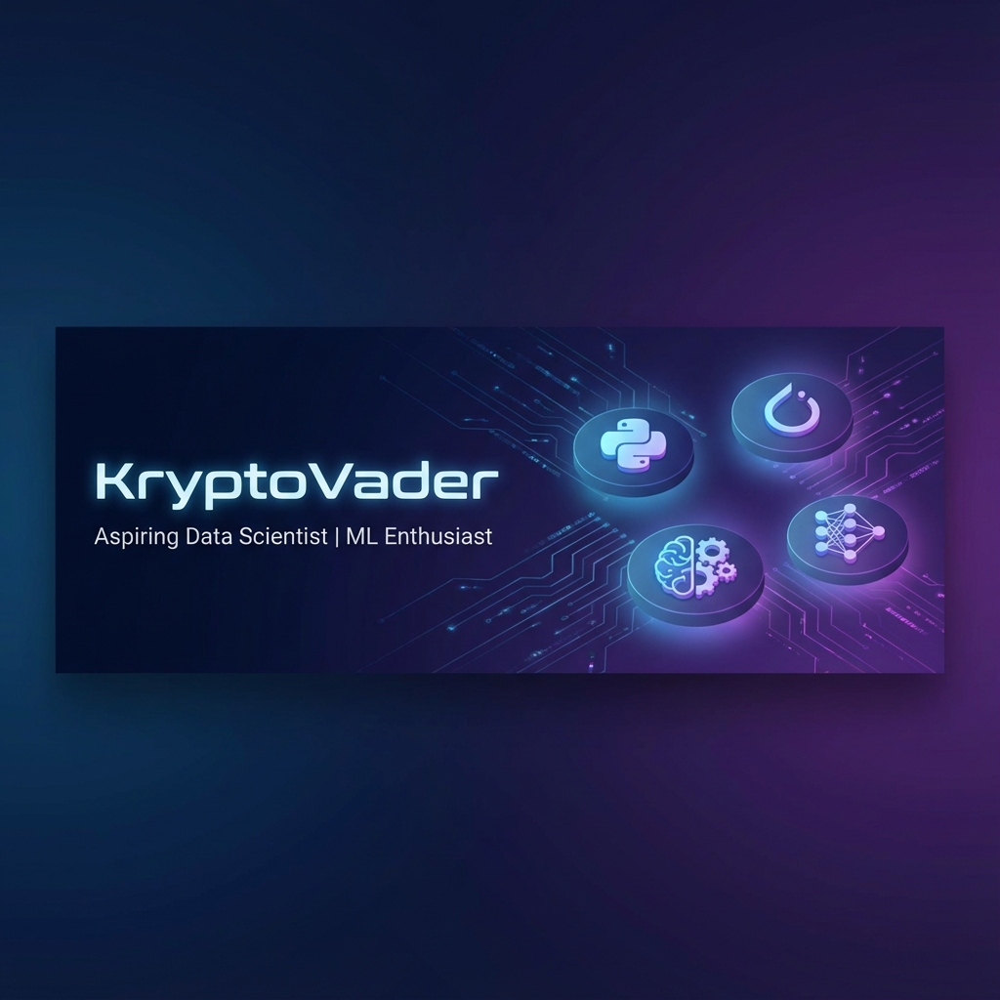

# Hi there, I'm Divyansh Shekhar 👋

## 🎓 About Me

I'm a passionate **student** and **aspiring Data Scientist** on a mission to leverage data for meaningful insights and innovative solutions. Currently diving deep into **Machine Learning** and exploring the fascinating world of artificial intelligence.

- 🔭 I'm currently focusing on **Machine Learning** and **Deep Learning**
- 🌱 Building projects with **Python**, **Java**, and cutting-edge **Data Science libraries**
- 🧠 Specializing in **PyTorch** for deep learning applications
- 💡 Love turning complex data into actionable insights
- 🚀 Always eager to learn and collaborate on exciting projects

## 🛠️ Tech Stack

### Languages

### Data Science & ML

### Web Development

### Tools & Platforms

## 📊 GitHub Stats

  

## 🚀 Featured Projects

### 🔬 [DataScience_Journey](https://github.com/KryptoVader/DataScience_Journey)
My comprehensive learning portfolio documenting my journey into Data Science, featuring hands-on projects, experiments, and insights.

### 🔄 [Fluxify](https://github.com/KryptoVader/Fluxify)
An all-purpose file converter supporting multiple formats. Built with TypeScript and deployed on Vercel for seamless conversions.

### 🤝 [SkilLink-Project](https://github.com/KryptoVader/SkilLink-Project)
A student networking platform built with the NEN stack (Node.js, Express, Neo4j) that connects students with teammates and mentors based on skills and research interests.

### 🏥 [JohnHopkins_Hackathon](https://github.com/KryptoVader/JohnHopkins_Hackathon)
Medical-themed hackathon project creating a communication bridge between hospital staff, doctors, and patients.

## 📫 Connect With Me

## 💭 Quote

> "Data is the new oil, but only if you know how to refine it." 

---

  

**Thanks for stopping by! Let's connect and build something amazing together! 🚀**

